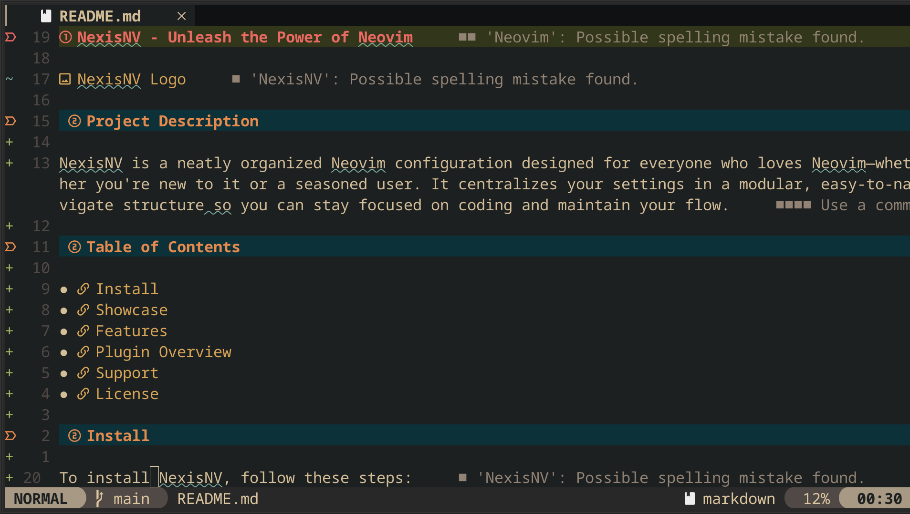
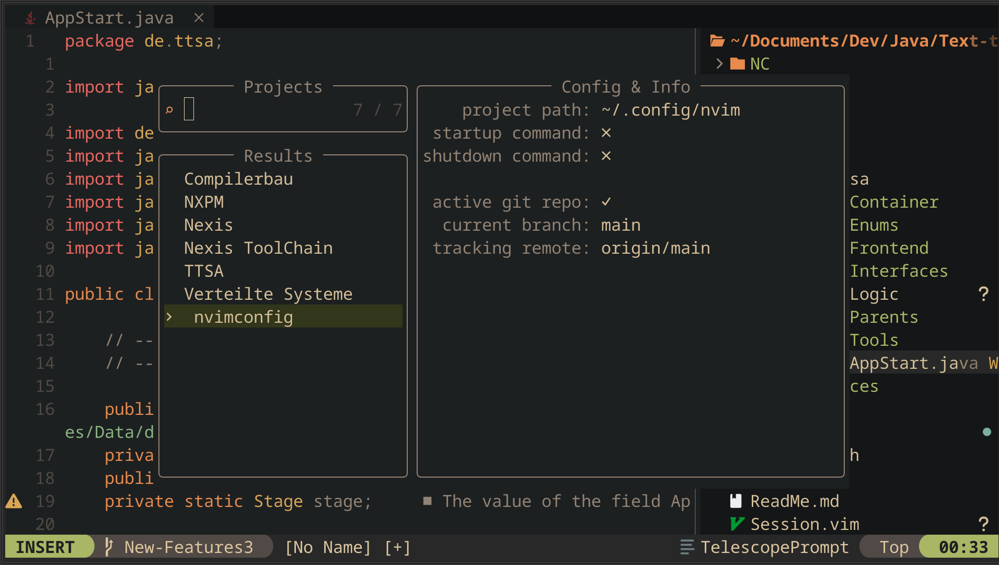
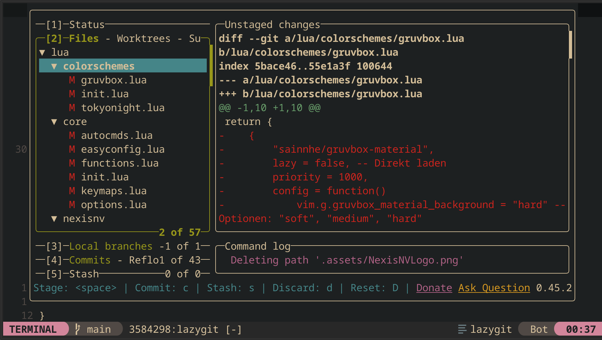
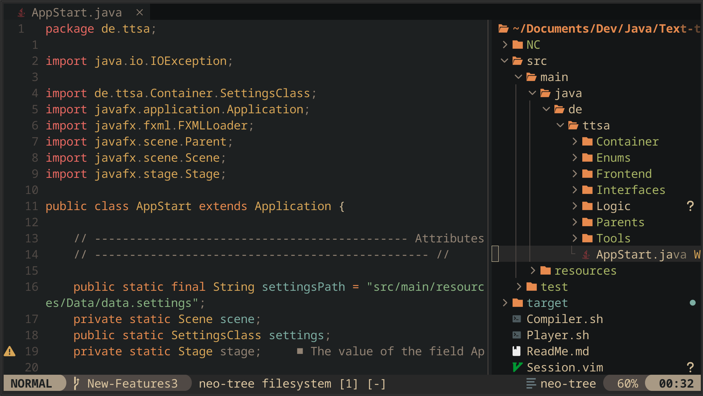
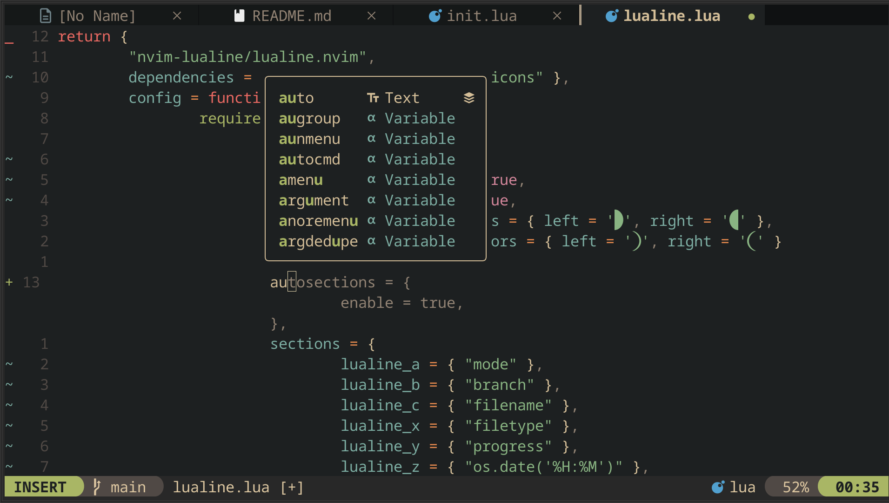

# NexisNV - Unleash the Power of Neovim


## Project Description

NexisNV is a neatly organized Neovim configuration designed for everyone who loves Neovim—whether you're new to it or a seasoned user. It centralizes your settings in a modular, easy-to-navigate structure so you can stay focused on coding and maintain your flow.


## Table of Contents

- [Install](#install)
- [Showcase](#showcase)
- [Features](#features)
- [Plugin Overview](#plugins-used-in-nexisnv)
- [Support](#support)
- [License](#license)


## Install

To install NexisNV, follow these steps:

### Prerequisites

Before installing **NexisNV**, make sure you have the following:

- **Neovim 0.9+** installed on your system
- **Git** installed on your system


##### For Debian/Ubuntu
```sh
sudo apt install neovim
```

##### For macOS (using Homebrew)
```sh
brew install neovim
```


### Installation Steps

1. If you want your previous Neovim Config, make sure to backup your current Neovim configuration. NexisNV will standardly zip your current configuration and save it in the `~/.config/nvim/backup.zip` directory.

2. Clone the NexisNV repository to your Neovim configuration directory. Either you clone it directly or you can use the automatic installation script.

##### Clone the Repository
If you want to manually clone the repository, run the following command:
```sh
git clone https://github.com/Matographo/NexisNV.git ~/.config/nvim
```

##### Automatic Installation
If you want to use the automatic installation script, run the following command:
(Automatic Backup and Installation)
```sh
git clone https://github.com/Matographo/NexisNV.git ~/.config/nvim/nexisnv && bash ~/.config/nvim/nexisnv/install.sh
```


## Showcase

Here are some screenshots of NexisNV in action:

### Markdown Preview


### Project View


### LazyGit


### FileTree


### Copilot And Autocompletion



## Features

1. **Beautiful Start Experience** – A clean and modern dashboard to welcome you every time you open Neovim.  
2. **Seamless Terminal Integration** – Quickly open and manage terminal sessions directly within Neovim.  
3. **Intelligent Code Assistance** – Powerful LSP support with autocomplete, diagnostics, and Treesitter-based syntax highlighting.  
4. **Effortless Navigation & Search** – Find files, symbols, and projects instantly with fuzzy searching and Telescope.  
5. **Enhanced Git Workflow** – Stay productive with inline Git blame, visual diffs, and integrated GitHub tools.  
6. **Markdown & LaTeX Ready** – Preview Markdown and LaTeX files directly inside Neovim with rich formatting.  
7. **Developer-Friendly Workflow** – Manage databases, use AI-assisted coding, and even work with Docker seamlessly.  


## Plugins Used in NexisNV

### 🌟 UI & Dashboard
- **[nexisnv.dashboard]** – Beautiful startup dashboard.
- **[nexisnv.themery]** – Theme manager for easy switching.
- **[nexisnv.lualine]** – Status line for a modern look.
- **[nexisnv.bufferline]** – Tabline with buffer management.
- **[nexisnv.noice]** – Enhanced UI notifications.

### 🚀 Navigation & Productivity
- **[nexisnv.telescope]** – Fuzzy finding and quick navigation.
- **[nexisnv.whichkey]** – Displays available keybindings dynamically.
- **[nexisnv.leap]** – Fast movement across the buffer.
- **[nexisnv.trouble]** – Quick problem and diagnostics lookup.
- **[nexisnv.projectmgr]** – Project management inside Neovim.
- **[nexisnv.neotree]** – File explorer for easy navigation.

### 🔧 Development & Coding Enhancements
- **[nexisnv.lspconfig]** – Language Server Protocol (LSP) support.
- **[nexisnv.mason]** – Simple installation of LSPs, formatters, and linters.
- **[nexisnv.autocmp]** – Autocompletion for a smooth coding experience.
- **[nexisnv.treesitter]** – Advanced syntax highlighting and parsing.
- **[nexisnv.treesitter_textobject]** – Text object manipulation.
- **[nexisnv.surround]** – Quick surround manipulation.
- **[nexisnv.align]** – Easy text alignment.

### 🛠️ Debugging & Testing
- **[nvim-neotest/nvim-nio]** – Testing framework integration.
- **[nexisnv.nvimdap]** – Debug Adapter Protocol (DAP) for debugging.
- **[nexisnv.neotest]** – Integrated test running.

### 🖥️ Terminal & External Tools
- **[nexisnv.toggleterm]** – Integrated terminal inside Neovim.
- **[nexisnv.lazygit]** – Git TUI inside Neovim.
- **[nexisnv.lazydocker]** – Docker TUI inside Neovim.
- **[nexisnv.dadbod]** – Database integration.
- **[nexisnv.avante]** – Custom utility plugin.

### 📝 Writing & Markdown
- **[nexisnv.markdownrender]** – Live Markdown preview.
- **[nexisnv.vimtex]** – LaTeX integration for Neovim.

### 🔥 Git Enhancements
- **[nexisnv.gitblame]** – Inline Git blame annotations.
- **[nexisnv.gitgutter]** – Shows Git diff indicators in the sign column.
- **[nexisnv.octo]** – GitHub issue & PR management inside Neovim.

### 🔀 Multi-Cursor & Selection
- **[nexisnv.visualmulti]** – Multi-cursor editing.


## Contributing

We’re always open to improvements, suggestions, and new ideas!  

If you have a feature request, a bug report, or simply a suggestion on how to make **NexisNV** better, feel free to share it.  

You can:  
- Open an **issue** for any improvement or request.  
- Suggest changes or enhancements.  
- Contribute directly by submitting a **pull request**.  

Every contribution, no matter how small, is appreciated! 


## License

This project is licensed under the **MIT License** – you are free to use, modify, and distribute it as you like.  
See the [LICENSE](./LICENSE) file for more details.
